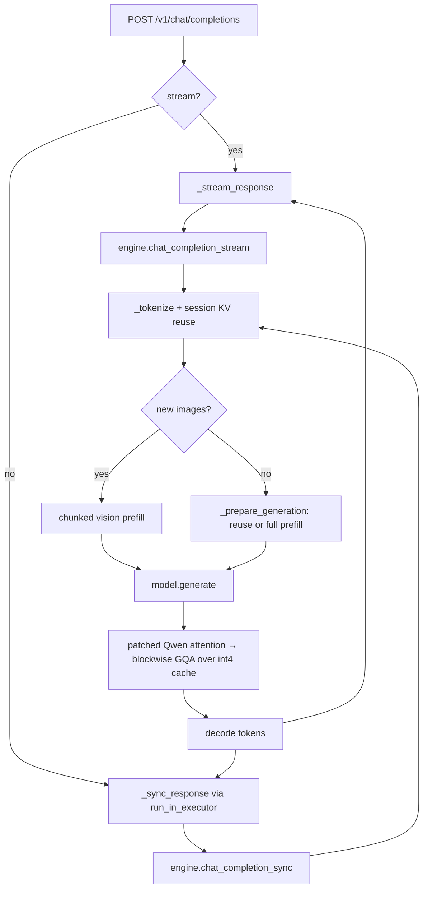

# Architecture

Sqush is a small package (`sqush/`) wrapping a quantized Qwen model behind an OpenAI‑compatible API and a CLI.

## Module map

| Module | Responsibility |
|--------|----------------|
| `__main__.py` | CLI entry: `download`, `bake`, `serve`, `chat`, `info`, `init`. Model resolution, baking dispatch, OpenCode config. |
| `config.py` | `SqushConfig` dataclasses, VRAM tiers, `load_config` (defaults → tier → YAML → env). |
| `download.py` | `download_model` + `_download_complete` (resume‑aware). |
| `quantize.py` | The heavy lifting: NF4 weight loading, embedding/`lm_head`/vision quantization, the int4 KV cache, the blockwise GQA attention, and the bake functions. |
| `engine.py` | `InferenceEngine`: tokenization, session KV reuse, chunked prefill, sync + streaming generation, vision path. |
| `server.py` | FastAPI app: endpoints, SSE streaming, tool‑call parsing, thinking‑block handling, throughput logging. |
| `cli.py` | Rich interactive chat. |

## Request lifecycle (serve)

## Startup (`load_and_quantize_model`)

1. Detect whether the checkpoint is already bitsandbytes‑quantized (`_model_is_pre_quantized`).
2. **Pre‑quantized path** — `from_pretrained` with the saved `quantization_config`; if `qs_pre_baked_embeddings` is set, route `embed_tokens` to CPU (avoid a 1.93 GB GPU allocation) and install a `QuantizedEmbedding` + NF4 `lm_head` afterward.
3. **Fresh bf16 path** — `from_pretrained` with a `BitsAndBytesConfig(load_in_4bit, nf4, double_quant)`.
4. Set `config._attn_implementation = "sqush"` so the model routes through the custom attention.
5. Patch the tokenizer chat template to honor `preserve_thinking` (needed for KV reuse).
6. Optionally quantize the visual encoder / embeddings.
7. Build the `SqushKVCache` factory and return `(model, tokenizer, processor, cache_factory)`.

## Import‑time patches (in `quantize.py`)

Two things run at import:

- `_patch_qwen_attention()` — monkeypatches `Qwen3_5Attention.forward` to route through the blockwise‑from‑cache path (covers cached prefill **and** decode).
- `_register_sqush_attention()` — registers `sqush_attention_forward` under the name `"sqush"` in `ALL_ATTENTION_FUNCTIONS`.

See [Attention](attention.md) for why both layers exist.

## The custom pieces, in one paragraph

Weights are NF4 (bitsandbytes) with custom 4‑bit paths for the embedding table and `lm_head`. The KV cache stores keys/values at int4, quantized once per 64‑token group and appended without re‑quantization ([KV cache](kv-cache.md)). Attention is a hand‑rolled online‑softmax kernel that dequantizes the cache one 1024‑token block at a time, so neither the full score matrix nor the full dequantized KV is ever materialized ([Attention](attention.md)) — this is what makes 256k context fit.
